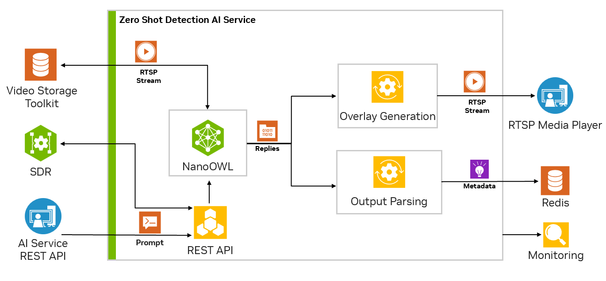

# Zero Shot Detection with Jetson Platform Services

docs: https://docs.nvidia.com/jetson/jps/inference-services/zero_shot_detection.html 


Other links:
1. https://github.com/NVIDIA-AI-IOT/nanoowl
2. https://arxiv.org/pdf/2205.06230 

Open vocabulary (classes defined at runtime, through CLIP embeddings) detections

Input: video live stream




VST -> RTSP INPUT -> NANOOWL -> OVERLAY -> RTSP OUTPUT

                             -> PARSE -> METADATA -> REDIS

PROMPT ->  REST API ->                             


Zero Shot Detection AI service (1 container, json config)

0. Install foundation services 
```bash
sudo apt update
sudo apt install nvidia-jetson-services
```

1. Download `zero_shot_detection-2.0.0.tar.gz` 

```bash
wget --content-disposition 'https://api.ngc.nvidia.com/v2/resources/org/nvidia/team/jps/reference-workflow-and-resources/2.0.0/files?redirect=true&path=zero_shot_detection-2.0.0.tar.gz' -O zero_shot_detection-2.0.0.tar.gz

tar -xvf zero_shot_detection-2.0.0.tar.gz
cd zero_shot_detection/example_1
```

2. Configure ingress service 

```bash
sudo cp config/zero_shot_detection-nginx.conf /opt/nvidia/jetson/services/ingress/config

sudo systemctl start jetson-ingress
sudo systemctl start jetson-redis
```

3. Run Zero shot service (first pull ~3 minutes + building engines 5 minutes)

```
sudo docker compose up -d
sudo docker ps
```


4. Use REST API (docs:  http://192.168.1.66:5010/docs)

set rtsp stream
```bash
curl -X 'POST' \
  'http://192.168.1.66:5010/api/v1/live-stream' \
  -H 'accept: application/json' \
  -H 'Content-Type: application/json' \
  -d '{
  "liveStreamUrl": "rtsp://192.168.1.66:31554/nvstream/opt/store/nvstreamer_videos/sample_1080p_h264.mp4",
  "description": ""
}'
```
get rtsp stream
```bash
STREAM_ID=`curl --location 'http://192.168.1.66:5010/api/v1/live-stream' | jq '.[0].id' | tr -d '"'`
```

add detection classes (thresholds 0.1 - 2.0)

```bash

curl --location 'http://192.168.1.66:5010/api/v1/detection/classes' \
--header 'Content-Type: application/json' \
--data '{
    "objects": ["a person", "a car", "a bus"],
    "thresholds": [0.1, 0.3, 0.3],
    "id": "{$STREAM_ID}"
}'


curl --location 'http://192.168.1.66:5010/api/v1/detection/classes' \
--header 'Content-Type: application/json' \
--data '{
    "objects": ["a person", "a car", "a bus", "a tree", "building", "a shadow"],
    "thresholds": [0.1, 0.3, 0.3, 0.05, 0.05, 0.05],
    "id": "{$STREAM_ID}"
}'

curl --location 'http://192.168.1.66:5010/api/v1/detection/classes' \
--header 'Content-Type: application/json' \
--data '{
    "objects": ["black car", "white car", "gray car", "red car", "red jacket", "backpack"],
    "thresholds": [0.05, 0.05, 0.05, 0.05, 0.03, 0.05],
    "id": "{$STREAM_ID}"
}'
```

5. View output stream  `rtsp://192.168.1.66:5011/out` 

```bash
ffplay rtsp://192.168.1.66:5011/out
```

6. View metadata 
```bash

docker exec -it redis bash

redis-cli XREAD COUNT 1 BLOCK 5000 STREAMS owl $
```

7. shutdown 

remove stream
```bash
curl --location --request DELETE 'http://192.168.1.66:5010/api/v1/live-stream/'$STREAM_ID
```
remove containers
```bash
sudo docker compose down
```


# Persistence of configuration with SDR (Sensor Distribution and Routing)

! TO PERSIST RTSP STREAMS AND CLASSES CONFIGS we need to add Sensor Distribution and Routing (SDR) service from  Zero Shot Detection Workflow page https://docs.nvidia.com/jetson/jps/workflows/zero_shot_detection_workflow.html.